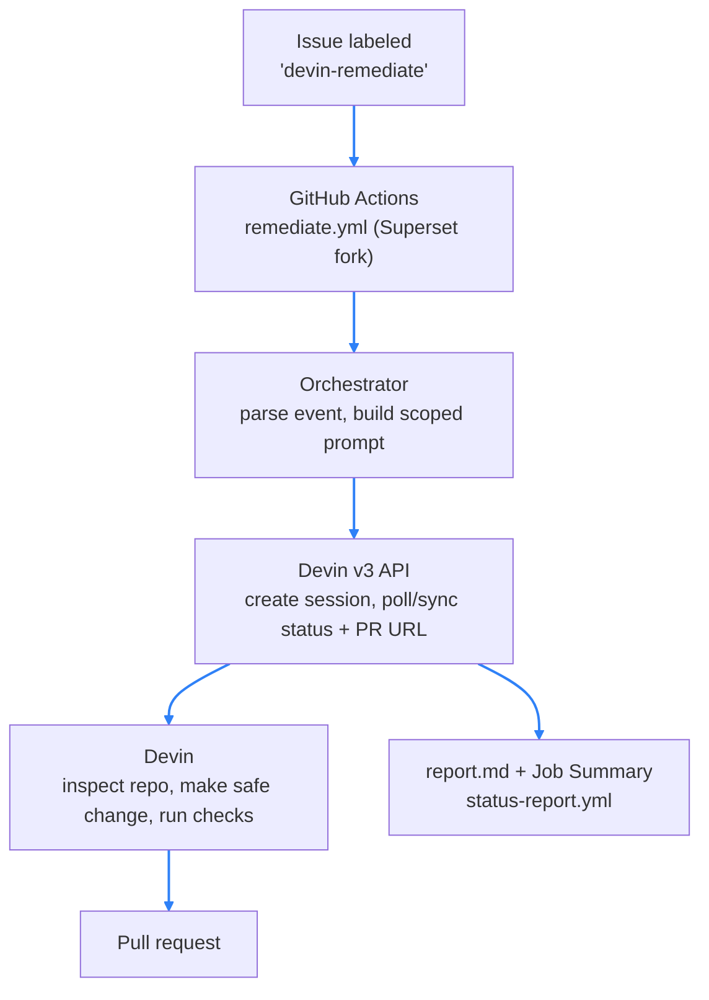

# Devin Issue Remediation Bot

An event-driven automation that turns a GitHub issue into a remediation pull request by
delegating the work to a [Devin](https://docs.devin.ai/api-reference/overview) session, then
tracks every delegated task so an engineering leader can see whether the workflow is working.

## Solution



The orchestrator builds a tightly scoped prompt from the issue, opens a Devin session, and
records the session. Within that session Devin works as an engineer: it inspects the repo,
makes a safe change, runs checks, and opens a pull request. A `poll` step later refreshes
each session's status and captures the PR URL, keeping `tasks.json` and `report.md` current.

## Event trigger

The automation fires when a GitHub issue is labeled `devin-remediate`. This is wired as a
GitHub Actions workflow (`.github/workflows/remediate.yml`) that runs `on: issues: [labeled]`.
Because the `issues` event only fires in the repository that owns the issues, the workflow
lives in the **Superset fork** (not in this repo); it checks out this bot and runs it against
the live event payload GitHub provides at `$GITHUB_EVENT_PATH`.

That payload has the exact shape of [fixtures/issue_labeled_event.json](fixtures/issue_labeled_event.json),
so the same `remediate --event` code path runs identically whether it is driven by the live
Action or replayed locally from the fixture for a reproducible demo.

To deploy the trigger on the fork:

1. Add `.github/workflows/remediate.yml` to the fork's default branch, with its `repository:`
   field set to this bot's repo.
2. Add `DEVIN_API_KEY` and `DEVIN_ORG_ID` as Actions secrets on the fork.
3. Create the `devin-remediate` label and apply it to an issue — the workflow auto-fires.

Status is observable separately, from this repo rather than the fork — see [Observability](#observability).

## How Devin is used

Devin is the remediation worker, not a helper. Given a repository and an issue URL, it inspects
the code, makes the smallest safe change, runs checks when practical, and opens a pull request.
The Python service is only an orchestrator: it decides _what_ to delegate and records _what
happened_. The prompt is built in [app/prompt.py](app/prompt.py).

## Setup

```bash
uv sync
cp .env.example .env   # fill in DEVIN_API_KEY + DEVIN_ORG_ID
```

Environment variables (see [.env.example](.env.example)):

- `DEVIN_API_KEY` — Devin v3 service-user token (`cog_*`), created under Settings -> Devin API
- `DEVIN_ORG_ID` — organization id (`org-*`) shown on the same Devin API settings page
- `DEVIN_BASE_URL` — defaults to `https://api.devin.ai` (v3 paths are scoped per organization)
- `DATA_DIR` — output directory for `tasks.json` / `report.md` (defaults to `data`)

## Run locally (uv)

[fixtures/issue_labeled_event.json](fixtures/issue_labeled_event.json) is a saved copy of the
`issues.labeled` event for a real issue in the fork. The live Action uses the payload GitHub
provides automatically, so this file is only for local replay. To replay a different issue,
regenerate it from that issue rather than editing the body by hand:

```bash
gh issue view <N> --repo <owner>/superset --json number,title,body,url \
  | python3 -c 'import json,sys; s=json.load(sys.stdin); json.dump({"action":"labeled","label":{"name":"devin-remediate"},"issue":{"number":s["number"],"title":s["title"],"html_url":s["url"],"body":s["body"],"labels":[{"name":"devin-remediate"}]},"repository":{"full_name":"<owner>/superset"}}, open("fixtures/issue_labeled_event.json","w"), indent=2)'
```

```bash
# Simulate the production event from a fixture
uv run python main.py remediate --event fixtures/issue_labeled_event.json --require-label

# Refresh active sessions and update tasks.json / report.md
uv run python main.py poll

# Print the current report
uv run python main.py report
```

## Run with Docker

The image uses a multi-stage build (uv resolves dependencies in the builder stage; the runtime
stage carries only the virtualenv and app code).

```bash
docker build -t devin-remediation-bot .

# Smoke test — no credentials needed; prints an empty report
docker run --rm devin-remediation-bot report

# Delegate an issue to Devin (needs DEVIN_API_KEY + DEVIN_ORG_ID in .env)
docker run --rm --env-file .env -v "$PWD/data:/app/data" \
  devin-remediation-bot remediate --event fixtures/issue_labeled_event.json

# Refresh session status, then print the updated report
docker run --rm --env-file .env -v "$PWD/data:/app/data" \
  devin-remediation-bot poll
docker run --rm -v "$PWD/data:/app/data" devin-remediation-bot report
```

The `data` volume mount persists `tasks.json` and `report.md` on the host. The `report`
smoke test needs no secrets, so a reviewer can verify the image builds and runs immediately.

## Observability

Status is meant to be checked from the web: the scheduled CI run summary is the primary view, and
the same state is also written to disk for local inspection.

- **CI run summary (primary)** — [.github/workflows/status-report.yml](.github/workflows/status-report.yml)
  runs every 10 minutes (and on demand) and renders the report into the run's Job Summary plus a
  downloadable artifact, so the latest run on the Actions tab always shows the current state with
  nothing to run locally and nothing committed back to the repo. The trigger lives on the fork,
  but this status-report workflow lives in **this** repo: add `DEVIN_API_KEY` and `DEVIN_ORG_ID`
  as Actions secrets here, then open the latest run on this repo's Actions tab — or trigger it
  manually — to see current status.
- **`data/tasks.json`** — machine-readable state per delegated task: issue, status,
  Devin session id/url, PR url, timestamps.
- **`data/report.md`** — a human-readable table with a status summary line
  (e.g. `Completed: 2 | Failed: 1`) so a leader can see throughput and what needs attention.

The `sync` command (`uv run python main.py sync`) is what that workflow runs: instead of reading
local state, it **lists the org's Devin sessions, recognizes the bot's own by their
`Remediate #<n>:` title, and rebuilds the report** — so Devin is the source of truth and no
`tasks.json` needs to persist between CI runs.

A task is marked **completed once Devin opens a pull request** — the session often lingers in
`waiting_for_user` ("awaiting instructions") after the work is done, so the PR, not the session
state, is the success signal. Until a PR exists the status reflects the Devin session
(`session_created -> working / blocked`, or `failed` if it ends without one), mapped from v3's
`status` / `status_detail` in [app/models.py](app/models.py).

## Tests

```bash
uv run pytest
```

Tests cover event parsing, prompt construction, the task store, report rendering, the Devin
client (mocked HTTP), and the orchestrator (mocked Devin client) — 47 cases.

## Limitations

- This is a demo, not a production GitHub App. The event trigger is a GitHub Actions
  workflow on the fork (issue labeled `devin-remediate`), not a standalone hosted webhook
  receiver; the bundled fixture replays the same payload locally.
- No dashboard UI; `poll` is run on demand and the scheduled status report renders to the
  Actions run summary rather than a hosted page.
- PR extraction relies on Devin reporting the PR on the session; complex multi-PR flows are out
  of scope.
- Scope was intentionally kept small to fit the 2–3 hour constraint.

## Next steps

- **Report retention / log rotation.** Today `sync` rebuilds the report from every matching
  Devin session, so completed tasks accumulate in the report indefinitely. A better design would
  separate the live view (active and recently-completed work) from history: roll older completed
  tasks into a dated archive and rotate the per-run log artifacts, so the status summary stays
  focused on what needs attention while the full session-by-session logs remain retrievable on demand.
